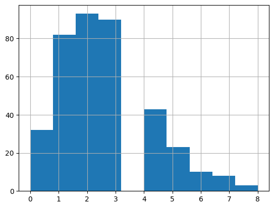
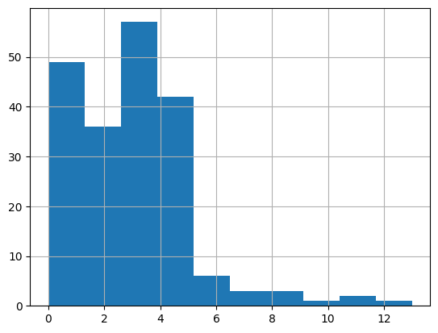

# ⚽ FIFA World Cup Goals Analysis: Women's vs Men's Matches

## 📌 Project Overview

This project investigates whether women's FIFA World Cup matches have a higher number of goals scored than men's FIFA World Cup matches since 2002.

Using statistical hypothesis testing, we compare the total goals scored per match in FIFA World Cup tournaments and determine whether the difference is statistically significant.

---

## 🎯 Business Question

> Are more goals scored in women's international FIFA World Cup matches than men's?

### Hypotheses

- **H₀ (Null Hypothesis):** The mean number of goals scored in women's FIFA World Cup matches is the same as men's.
- **H₁ (Alternative Hypothesis):** The mean number of goals scored in women's FIFA World Cup matches is greater than men's.

**Significance Level:** α = 0.01

---

# 📥 Load Libraries

```python
import pandas as pd
import matplotlib.pyplot as plt
import pingouin
from scipy.stats import mannwhitneyu
```

# 📥 Load Men's Dataset

```python
men = pd.read_csv("men_results.csv")
print(men.head())
```

### Sample Output

| Date | Home Team | Away Team | Home Score | Away Score |
|------|------------|------------|------------|------------|
| 1872-11-30 | Scotland | England | 0 | 0 |
| 1873-03-08 | England | Scotland | 4 | 2 |

---

# 📥 Load Women's Dataset

```python
women = pd.read_csv("women_results.csv")
print(women.head())
```

### Sample Output

| Date | Home Team | Away Team | Home Score | Away Score |
|------|------------|------------|------------|------------|
| 1969-11-01 | Italy | France | 1 | 0 |
| 1969-11-01 | Denmark | England | 4 | 3 |

---

# 🔍 Explore Dataset Structure

```python
print(men.info())
print(women.info())
```

### Dataset Summary

| Dataset | Rows | Columns |
|----------|----------:|----------:|
| Men's Matches | 44,353 | 7 |
| Women's Matches | 4,884 | 7 |

---

# 📊 Tournament Distribution

```python
men["tournament"].value_counts()
women["tournament"].value_counts()
```

The FIFA World Cup tournament exists in both datasets and will be used for the analysis.

---

# 🎯 Filter FIFA World Cup Matches Since 2002

```python
men["date"] = pd.to_datetime(men["date"])
women["date"] = pd.to_datetime(women["date"])

men_subset = men[
    (men["date"] > "2002-01-01")
    & (men["tournament"] == "FIFA World Cup")
]

women_subset = women[
    (women["date"] > "2002-01-01")
    & (women["tournament"] == "FIFA World Cup")
]
```

### Result

- Women's World Cup Matches: 200
- Men's World Cup Matches: 384
- Total Matches Analyzed: 584

---

# ⚽ Create Goals Scored Feature

```python
men_subset["goals_scored"] = (
    men_subset["home_score"] + men_subset["away_score"]
)

women_subset["goals_scored"] = (
    women_subset["home_score"] + women_subset["away_score"]
)
```

---

# 📈 Distribution Analysis

```python
men_subset["goals_scored"].hist()
plt.show()
```



```python
women_subset["goals_scored"].hist()
plt.show()
```

### Interpretation

The distributions are not normally distributed.

Therefore, a non-parametric statistical test is required.

---

# 🔄 Combine Datasets

```python
both = pd.concat(
    [women_subset, men_subset],
    axis=0,
    ignore_index=True
)
```

### Combined Dataset

| Metric | Value |
|---------|--------:|
| Total Rows | 584 |
| Columns | 9 |

---

# 📋 Prepare Data for Hypothesis Testing

```python
both_subset = both[["goals_scored", "group"]]

both_subset_wide = both_subset.pivot(
    columns="group",
    values="goals_scored"
)
```

---

# 🧪 Mann–Whitney U Test

```python
result_pg = pingouin.mwu(
    x=both_subset_wide["women"],
    y=both_subset_wide["men"],
    alternative="greater"
)

result_pg
```

### Output

| Metric | Value |
|---------|---------:|
| U Statistic | 43273 |
| Alternative | greater |
| P-value | 0.005107 |
| RBC | 0.126901 |
| CLES | 0.563451 |

---

# ✅ Final Decision

```python
p_val = result_pg["p_val"].values[0]

if p_val <= 0.01:
    result = "reject"
else:
    result = "fail to reject"

result_dict = {
    "p_val": p_val,
    "result": result
}

result_dict
```

### Output

```python
{'p_val': 0.005106609825443641, 'result': 'reject'}
```

---

# 🎯 Conclusion

The p-value (0.0051) is lower than the significance level (0.01).

Therefore, we reject the null hypothesis.

### Key Insight

Women's FIFA World Cup matches have significantly higher goal-scoring outcomes than men's FIFA World Cup matches during the period analyzed (2002 onward).

---

# 🚀 Skills Demonstrated

- Python
- Pandas
- Data Cleaning
- Exploratory Data Analysis (EDA)
- Data Visualization
- Statistical Hypothesis Testing
- Mann–Whitney U Test
- Sports Analytics

---

## 👤 Author

Adham Refaat Soliman

Data Analyst | Python | SQL | Power BI | Sports Analytics
